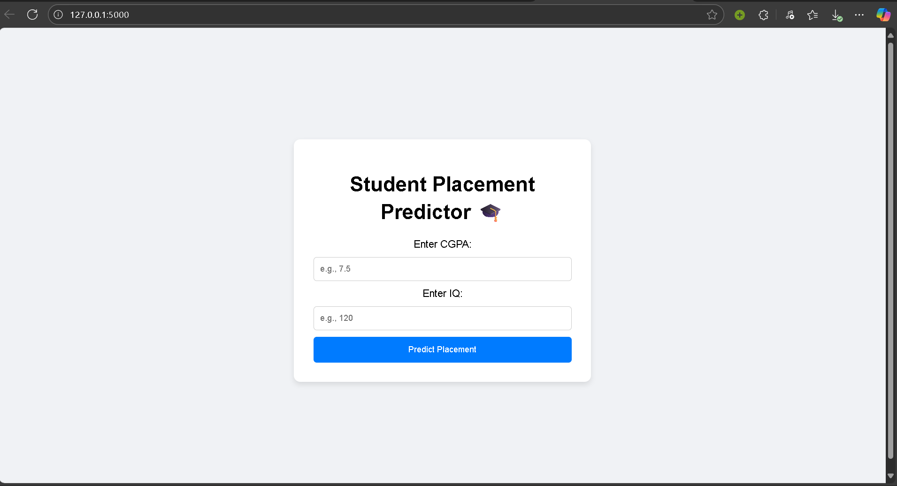

# Student Placement Predictor 🎓

A simple web application that uses a machine learning model to predict whether a student will get a job placement based on their CGPA and IQ. This project is built with Python and Flask.

---

## Demo 📸



---

## Features ✨

-   A simple and clean user interface for easy interaction.
-   Accepts student's CGPA and IQ as inputs.
-   Uses a trained Logistic Regression model to predict the placement outcome.
-   Displays the prediction result ("Placed" or "Not Placed") in real-time.

---

## Technologies Used 🛠️

-   **Backend:** Python, Flask
-   **Machine Learning:** Scikit-learn, Pandas, NumPy
-   **Frontend:** HTML, CSS

---

## How to Run This Project Locally 🚀

To get this project running on your own machine, follow these simple steps.

#### 1. Clone the Repository
Open your terminal or command prompt and clone this repository using the following command:

```bash
git clone [https://github.com/YourUsername/placement-predictor.git](https://github.com/YourUsername/placement-predictor.git)
